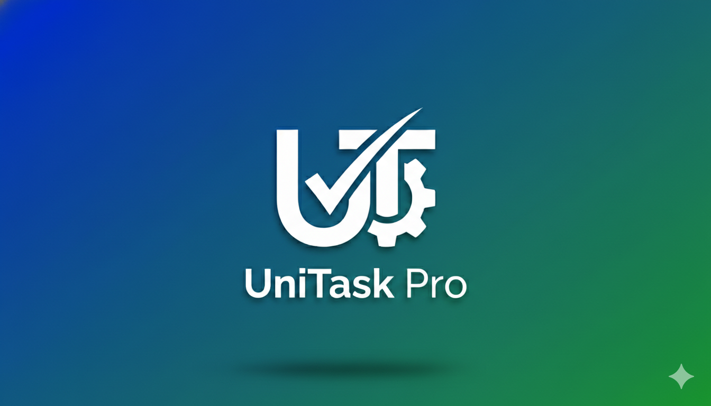

# 📝 UniTask Pro - Smart Task Management App

UniTask Pro is a robust and user-friendly Android application designed to help users organize their daily lives efficiently. Built with **Java** and **XML**, it leverages local database storage and system services to provide a seamless task management experience.

<p align="center">
  
</p>

## 🚀 Key Features

* **🔐 User Authentication:** Secure Login and Registration system with "Remember Me" functionality.
* **✨ Task Management:** Create, Read, Update, and Delete (CRUD) tasks effortlessly.
* **📅 Smart Scheduling:** Set due dates and receive push notifications when tasks are due (powered by AlarmManager).
* **🔥 Priority System:** Organize tasks by importance (High, Medium, Low) with visual indicators.
* **🎨 Dynamic UI:** Clean Material Design interface with **Dark Mode** & Light Mode support.
* **📂 Sorting & Filtering:** Sort tasks by date or priority level to focus on what matters.
* **💾 Local Persistence:** All data is safely stored locally using **SQLite Database**.

## 🛠️ Tech Stack & Tools

* **Language:** Java
* **UI/Layout:** XML (Material Design Components)
* **Database:** SQLite (Local Storage)
* **IDE:** Android Studio
* **Version Control:** Git

## 📦 How to Run

1.  Clone this repository:
    ```bash
    git clone [https://github.com/saeidmadhi/UniTask-Pro.git](https://github.com/saeidmadhi/UniTask-Pro.git)
    ```
2.  Open the project in **Android Studio**.
3.  Sync Gradle files.
4.  Run on an emulator or a physical Android device.

## 👨‍💻 Developer

Developed by **Saeid Madhilaleh** as a Computer Engineering Senior Design Project.

---
*Feel free to star ⭐ this repository if you find it useful!*